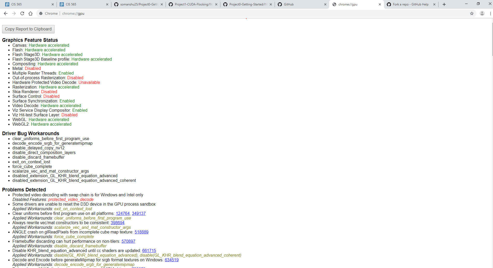
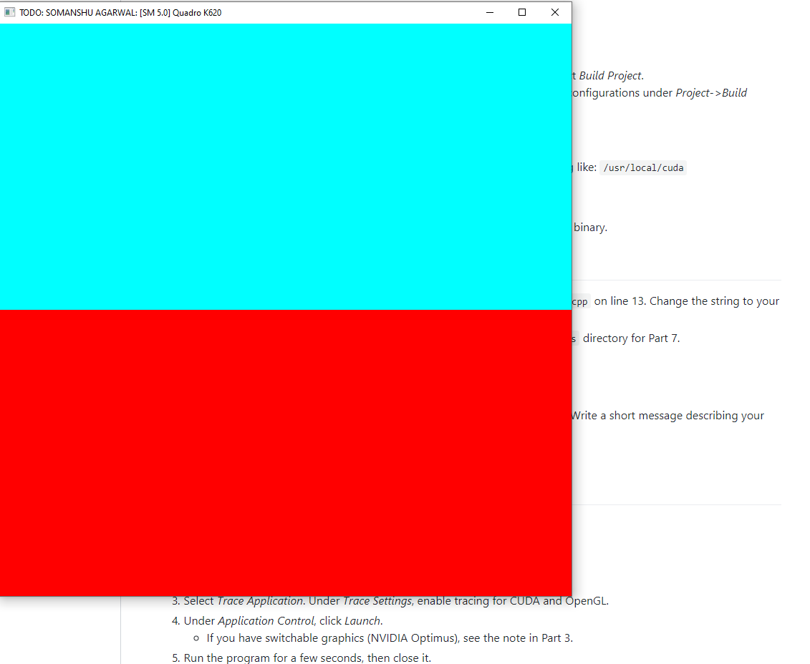
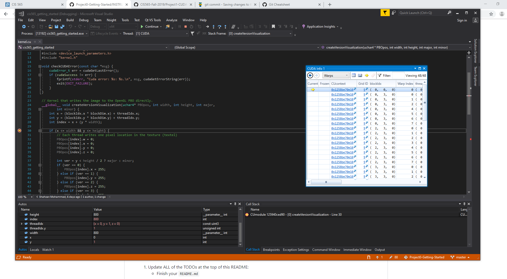

Project 0 Getting Started
====================

**University of Pennsylvania, CIS 565: GPU Programming and Architecture, Project 0**

* NAME: SOMANSHU AGARWAL
  * www.linkedin.com/in/somanshu25
* Tested on: Windows 22, i7-2222 @ 2.22GHz 22GB, GTX 222 222MB (Moore 2222 Lab)

###

The follwing is the report for the HW0 submission. I'm submitting the assignment late as I was outside United States till 1st September and I had MacBook with Intel Iris GRaphics Card, thus I could not run CUDA in the laptop and had to use one of the computers in the lab.

I used one of the lab computers in Moore 100C. The Git Bash, Microsoft Visio 2017, CUDA were installed in the computer and the chrome browser supported WebGL.

## Part 2.1
THe CUDA compute compatibility of the computer is

## Part 2.2: Checking WebGL status

The screenshot showing the WebGL status seen in chrome is below:

We can see that WebGL is enabled and hardware-accelerated.

## Part 2.3:
Skipping the part as I'm submitting HW0 from the Moore computer4.

# Part3 and Part 4
After going throuhg all the steps and performing Build and Run in Microsoft Visio 2017, I got the new window with lagenta anf red colors on the screen. Further, on the task bar, I replaed the string "YOUR NAME HERE" with my actual name and the scrrenshotb of the new window is below:

# Part 5
After getting introduced to Visio, this part deals with going through Nsight application for getting familiar with the CUDA interface. The steps provided were done to see how to analyze the running details of the program on the GPU. The scrrenshot for showing the analysis of the test project is given below:

# Part 6
This part deals with getting familiar with Debugging interface of Nsight. The part helps to get familiar with introducing the breakppoints and how the analyse the values which have changed after iterating throught the breakpoints and the various conditional conditioms you can further apply for the breakpoints. The screenshot showing CUDA info with Wrap is below:

FInally I committed and pushed all the changes into the GitHub Reporitory which was forked on my GitHub account.
